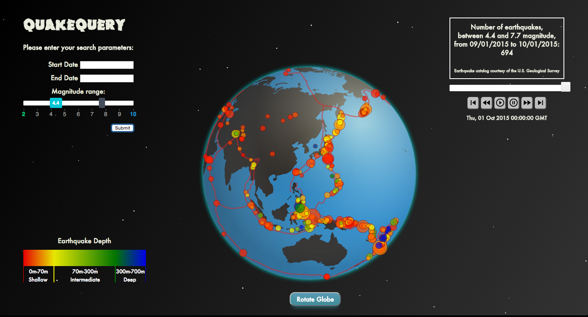

# quakeQuery

- quakeQuery is a single-page application, built with Node.js and D3.js and consuming the USGS Earthquake Catalog API, which allows users to visualize the location, magnitude, and depth of selected earthquakes on a rotating and/or manipulatable globe.

- Users can search the earthquake catalog for a selected range of dates and range of magnitudes. A depth gradient is provided which defines the relationship between earthquake depth and color. Tectonic plate boundaries are overlaid on to the globe.s

---

---

- A mouseover on a single earthquake point will reveal a text box with detailed information about that earthquake, and a click will bring the user to the earthquake event page on the USGS website.

---

---

- A timelapse feature allows the user to observe the sequential progression of earthquakes over the course of the selected date range. More fine-tuned control is provided by a manipulatable slider and buttons for play, pause, slow fast-forward and reverse, and jump to the beginning or end.

---

---

#url

http://quakequery.herokuapp.com/

---

#Technologies

* Node.js
* Express.js
* D3.js

##User Stories

1. As a user, I want to be able to view a representation of the earth with tectonic plate boundaries, so that I can get a more realistic sense of the geography of earthquakes.
2. As a user, I want to be able to start or stop the rotation of the globe, so that I can have more control over the visualizations of the application.
3. As a user, I want to be able to search by date range and magnitude, so that I can view only the earthquakes that I am interested in.
4. As a user, I want to be able to see a visual representation of the size and depth of each earthquake, along with the location, so that I can get a sense of the earthquake patterns at different parts of the globe.
5. As a user, I want to be able to get more information about each quake when I mouseover it, so that I can limit my search to a single quake.
6. As a user, I want to be able to see a time-lapse of the earthquakes as they occur over the selected date range, so that I can get a better understanding of the timing and location of the earthquakes.
